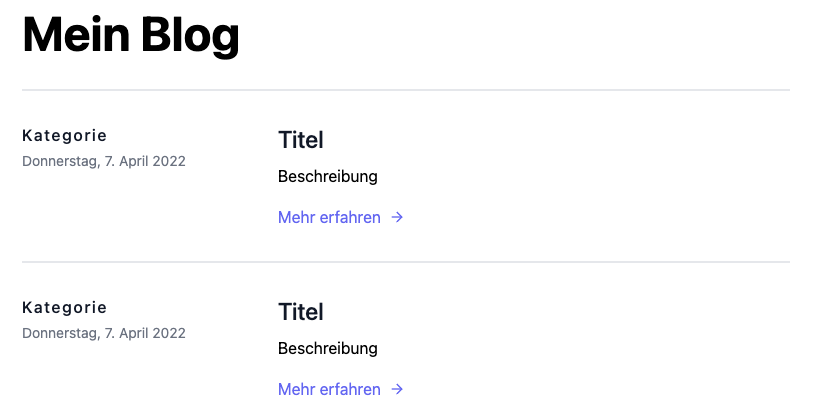
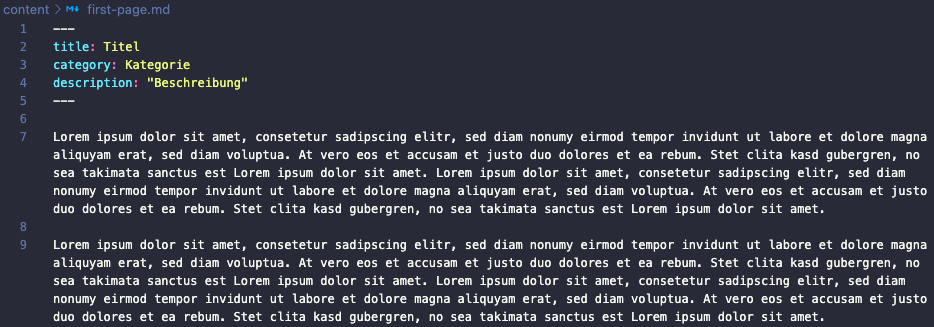

# nuxt-blog

## Description

Very simple blog page.

---

Parsed Markdown files into blog articles.

Create a new markdown file in the content folder, then a blog article will be created automatically from the file.

Example: content/first-page.md

